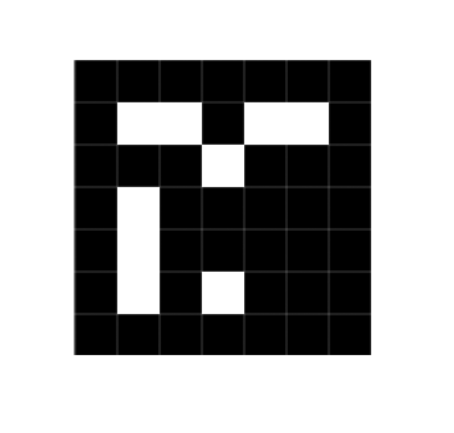

# ArPipe Framework Sandbox for iOS
==================

iOs Sandbox for ArPipe Framework

## Requirements

Sandbox is optimized for iOS 5.0 and higher. Only requirement is adding lastest version of Framework <https://github.com/megii/ArPipe-Framework> into Framework directory.

To run application is required to have Xcode installed with iOS 5.0 or greater support and valid developer certificate to deploy application on device.

## Quick start

- Download lastest release of [Framework](https://github.com/megii/ArPipe-Framework) and [sandbox](https://github.com/megii/ArPipe-Framework)
- Insert ArPipe framework into Framework directory in root of sandbox
- Open AR.xcodeproj in your xcode
- Build and Run using Xcode

## Hello World sample

In ViewController.mm class is prepared basic video processing loop with camera video source and display output. The only thing, that must developer do, is add Pipes into PipeLine.
  
    CameraFrameSource *frameSource = [[CameraFrameSource alloc] init];
    
    BaseArView *previewLayer = [[BaseArView alloc]
            initWithFrameAndCaptureSession: self.view.frame captureSession: [frameSource captureSession]];
    
    ArPipe::PipeLine* pipeline = new ArPipe::PipeLine([frameSource frameSource]);
    
    pipeline->addPipe(ArPipe::PolarRotate::init(90));
    pipeline->addPipe(ArPipe::BlackAndWhite::init());
    pipeline->addPipe(ArPipe::Threshold::init());
    
    pipeline->addNextPipe([previewLayer pipeConnector]);
    
    [self.view addSubview: previewLayer];
    [previewLayer showFrameOutput];
    [frameSource start];

There is `CameraFrameSource` object, which provides video data into `PipeLine` and after `PipeLine` there is attached a `BaseArView` preview layer. Purpose of sampe is rotate the image ninety degrees, convert it from color to black and white and then apply threshold filter. Result is shown on screen of device.

## Working with ArPipe framework

Introduction to ArPipe framework is described in README.md in [Framework repository](https://github.com/megii/ArPipe-Framework/blob/master/README.md).

Complete API documentation is provided in HTML format in `/doc/index.html` in sandbox repository.

## Mapping 3D objects to recognized markers

For more complex sample I used implementation from [ARUCO](http://www.uco.es/investiga/grupos/ava/node/26) framework. This code detects simple markers described below. When marker is detected, application will show 3D Cube in EAGL view layer. This whole code is in `viewDidLoad` method in main view controller.

	CameraFrameSource *frameSource = [[CameraFrameSource alloc] init];
    
    BaseArView *previewLayer = [[BaseArView alloc]
            initWithFrameAndCaptureSession: self.view.frame captureSession: [frameSource captureSession]];
    
    ArPipe::PipeLine* pipeline = new ArPipe::PipeLine([frameSource frameSource]);
    
    pipeline->addPipe(ArPipe::PolarRotate::init(90));
    pipeline->addPipe(ArPipe::BlackAndWhite::init());
    ArPipe::BlackAndWhite *blackAndWhite = (ArPipe::BlackAndWhite*) pipeline->back();
    
    pipeline->addPipe(ArPipe::Threshold::init());
    pipeline->addPipe(ArPipe::FindContours::init()
                      ->setTypeTree());
    pipeline->addPipe(ArPipe::DetectPolygons::init()->setOnlyConvexObjects()
                      ->setRequiredSideCount(4)
                      ->setComplexityKoef(0.5));
    
    ArPipe::FiducidalMarkerIdentifier *mId = (ArPipe::FiducidalMarkerIdentifier*) pipeline
        ->addNextPipe(ArPipe::FiducidalMarkerIdentifier::init()
                      ->setFrameSource(blackAndWhite)
                      ->setShapesSource(pipeline));
    
    blackAndWhite->addNextPipe(mId);
    
    ArPipe::CameraApply *camApply
        = (ArPipe::CameraApply*) mId->addNextPipe(
                            ArPipe::BlackAndWhite::init()->toColor()
                    )->addNextPipe(ArPipe::CameraApply::init());
    
    camApply->addNextPipe(ArPipe::DrawContours::init())
        ->addNextPipe([previewLayer pipeConnector]);
    
    previewLayer->cp = camApply->getCameraParameters();
    
    [self.view addSubview: previewLayer];
    
    [previewLayer showFrameOutput];
    [previewLayer showGlView];
    
    [frameSource start];
    
For the marker image is used fiducial markers from ARUCO framework. For testing purposes you can use displayed below one.

